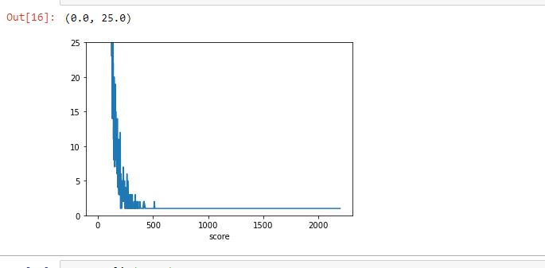
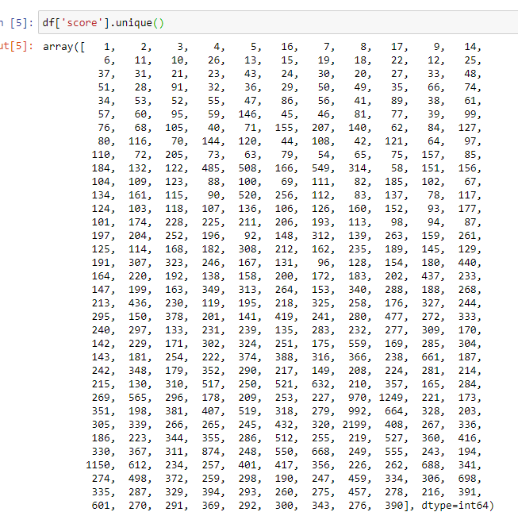

# How does the Recommednation AI work.

## Model 1: 

- The Recommendation engine uses: 
- It adds the interaction scoring as the following:

### Algorithm Implemented

### Our Scoring System

### Distribution of scores:

## Model 2: Capping

- The idea is to cap the scores by 5 points if >= 5

## Model 3: Score by Major Action

- The idea 

## Model 4: Tiering

- The idea is to create tiers of scores where we classify 

